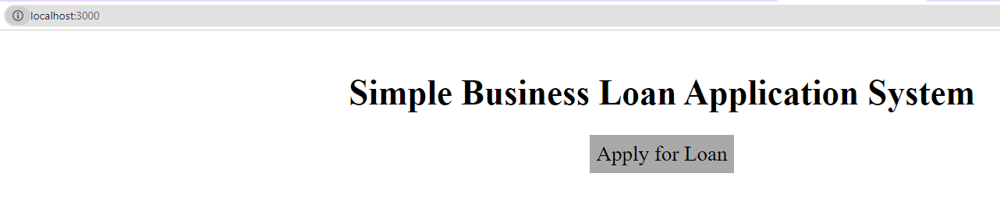

# Demyst-Data---Technical-Test

[Problem Statement](QUESTION.md)

## TechStack

- Python

- JS

- React

- HTML

- CSS

- Docker

- Docker Compose

## Implementation Details

- Frontend App is on - localhost:3000

###### *Landing Page:*

###### *Application:*

- Backend API is on - localhost:5000

###### *Swagger:*

## To run

### *Docker*

Install docker enginer or Docker Desktop

`docker-compose up --build`

*OR*

`docker-compose up`

### *Locally*

1. Install *python 3.10*

2. Install *pipenv*

3. Install *nodejs 19.x*

4. Install *npm* and *yarn*

#### Terminal 1:

`cd app`

`yarn install`

`yarn start`

#### Terminal 2:

`pipenv install`

`pipenv run unit-tests`

`pipenv run start-api`
